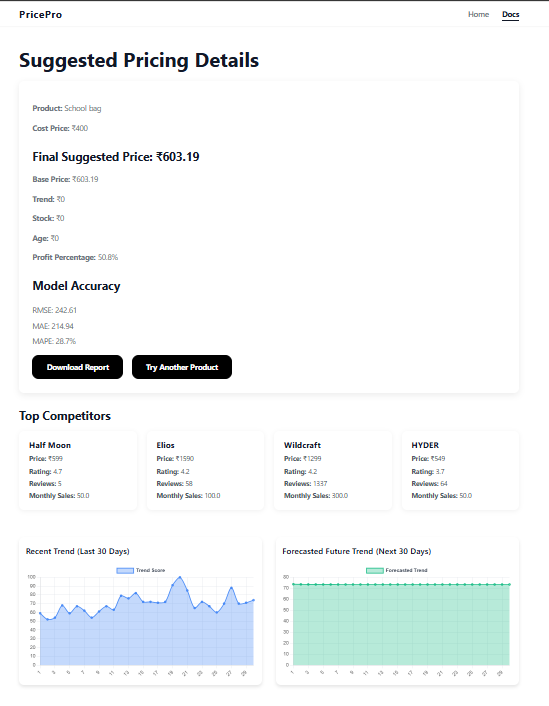

# Dynamic Price Prediction

## Features

- Predicts optimal product prices using machine learning.
- Scrapes competitor data like price, ratings, and reviews from Amazon.
- Forecasts product demand using Google Trends.
- Combines XGBoost and ARIMA for accurate predictions.
- Uses heuristic rules (stock, age, margin) to fine-tune final prices.
- Clean, user-friendly UI built with Flask and HTML templates.

---

## Tech Stack

- **Python & Flask** – For backend development and web server.
- **XGBoost** – For machine learning-based base price prediction.
- **ARIMA (statsmodels)** – For time-series demand forecasting.
- **BeautifulSoup & Requests** – For scraping data from Amazon.
- **PyTrends** – Google Trends integration for demand score.
- **HTML, CSS** – For frontend design and interaction.

---
## Screenshot



## nstallation

To get started with the project, follow these steps:

```
git clone https://github.com/your-username/dynamic-price-prediction.git
cd dynamic-price-prediction
pip install -r requirements.txt
python system.py
```


Project Structure
```
└── dynamic-price-prediction/
    ├── system.py               # Main Flask backend logic
    ├── style.css               # Styling for the frontend
    ├── requirements.txt        # Project dependencies
    └── templates/
        ├── index.html          # Input form page
        ├── result.html         # Price prediction result page
        └── docs.html           # Help or documentation page

